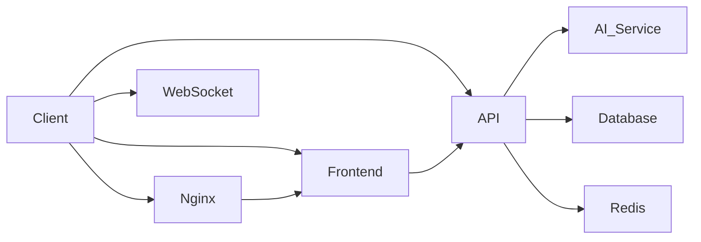

# C2 PDF Payload Injection Platform

## Overview

A comprehensive, production-ready PDF payload injection platform featuring advanced C2 (Command & Control) capabilities with AI-powered mutation management. The system provides secure PDF upload, intelligent injection, real-time monitoring, and analytics for cybersecurity workflows.

## Features

### 🎯 Core Capabilities
- **PDF Injection Pipeline**: Upload, validate, inject payloads
- **AI Mutation Engine**: Natural language strategic planning and execution  
- **Real-time Monitoring**: Live status tracking and performance analytics
- **Advanced Management**: Template library, sandbox testing, rollback support
- **Professional Interface**: Dark cyberpunk aesthetic with glassmorphic design

### 🔧 Technical Highlights
- **Full-stack Solution**: FastAPI backend + React frontend
- **AI Integration**: Featherless.ai with uncensored 12B model
- **Real-time Updates**: WebSocket communication for live data
- **Production Ready**: Comprehensive error handling, monitoring
- **Security Focused**: Encrypted communications, role-based auth

## Quick Start

### 1. Project Structure
```
├── src/
│   ├── c2_server/           # Backend application
│   │   ├── app.py          # FastAPI application
│   │   ├── schemas.py      # Data models
│   │   └── ...
│   └──
│       ├── components/     # React components
│       ├── hooks/          # Custom hooks
│       ├── styles/          # CSS styles
│       └── utils/           # Helper functions
├── docs/                    # Documentation
├── docker/                 # Docker configurations
└── tests/                  # Test suite
```

### 2. Backend Setup (FastAPI + WebSocket)
```bash
# Install Python dependencies
python3 -m pip install fastapi uvicorn websockets httpx aiohttp python-multipart

# Start the backend server
source venv/bin/activate  # From project root
python3 -m uvicorn src.c2_server.app:app --host 0.0.0.0 --port 8000 --reload
```

### 3. Frontend Setup (React + Vite)
```bash
# Install Node dependencies
npm install

# Start the frontend development server
npm run dev
```

### 4. Access the Application
- **Backend API**: `http://localhost:8000`
- **Frontend UI**: `http://localhost:3000`

## API Endpoints

### Authentication & Health
```bash
# Check API health
GET http://localhost:8000/health

# Login (if authentication is enabled)
POST http://localhost:8000/api/auth/login
```

### PDF Injection
```bash
# Upload and inject payload
POST http://localhost:8000/api/pdf/upload
Content-Type: multipart/form-data

# Required fields:
- file: PDF file (max 100MB)
- strategy: "auto" | "template_name" | "custom"
- payload: Payload content (if strategy is "custom")
```

### AI Mutation Management
```bash
# Get current system context
GET http://localhost:8000/api/ai/context

# Execute mutation strategy
POST http://localhost:8000/api/ai/mutate
Content-Type: application/json

{
  "chat": "Increase evasion by 20% and rotate all IPs"
}
```

### Chat Interface
```bash
# AI chat with full system context
POST http://localhost:8000/api/ai/chat
Content-Type: application/json

{
  "chat": "What is the current system status?",
  "context": true  # Optional, returns full system context
}
```

### Real-time Updates
```bash
# WebSocket connection for live updates
ws://localhost:8000/ws/dashboard

# Subscribe to different message types
- mutation_status
- ai_chat
- ai_mutate
- pdf_status
- stats
```

## Configuration

### Environment Variables (.env)
```env
# Server Configuration
PORT=8000
HOST=0.0.0.0

# AI Configuration
FEATHERLESS_API_KEY=your_api_key_here
FEATHERLESS_API_URL=https://api.featherless.ai/v1
MODEL_NAME=DreamFast/gemma-3-12b-it-heretic-v2

# Redis Cache
REDIS_URL=redis://localhost:6379

# Upload Settings
MAX_UPLOAD_SIZE=100MB
ALLOWED_EXTENSIONS=pdf

# Security
SECRET_KEY=your_secret_key_here
CORS_ORIGINS=http://localhost:3000
```

### AI Configuration (.env)
```env
# The AI Brain reads these via src/ai_brain/llm.py → LLMInterface
FEATHERLESS_API_KEY=your_api_key_here
FEATHERLESS_API_URL=https://api.featherless.ai/v1/chat/completions
FEATHERLESS_MODEL=DreamFast/gemma-3-12b-it-heretic-v2
```

## Core Functionality

### Backend (FastAPI Application)
1. **WebSocket Server** (`/ws/dashboard`):
   - Handles real-time communication
   - Broadcasts system status updates
   - Manages client connections

2. **PDF Injection Engine** (`/api/pdf/upload`):
   - Validates PDF structure
   - Injects payloads based on strategy
   - Returns injection status and metadata

3. **AI Mutation Engine** (`/api/ai/mutate` & `/api/ai/chat`):
   - Generates strategic plans from natural language
   - Executes mutation actions
   - Updates system state based on results

4. **System Context API** (`/api/ai/context`):
   - Provides current system status
   - Includes active nodes, evasion scores, mutation history
   - Supports real-time monitoring

### Frontend (React Application)
1. **Main Dashboard**:
   - Real-time status display
   - Connection status indicators
   - System statistics overview

2. **AI Chat Interface**:
   - Natural language command input
   - AI response display with timestamps
   - Quick command buttons for common operations

3. **Mutation Control Panel**:
   - Strategy execution controls
   - Real-time mutation results
   - Progress tracking and rollback options

4. **PDF Management**:
   - File upload with drag-and-drop
   - File preview and metadata display
   - Injection status tracking

## Key Components

### 1. AI Brain (Central Orchestrator)
The AI Brain (`src/ai_brain/brain.py`) is the autonomous reasoning core:
- **Reasoning Pulse**: Continuous loop (every 15s) that evaluates system state and autonomously escalates/destages mutation modes based on threat levels
- **Log Monitor Pulse**: Tails system logs, detects threat signatures, feeds threats to the reasoning loop
- **Threat Escalation**: Auto-escalates: 2+ high threats → ghost mode, 5+ threats → polymorphic
- **LLM Integration**: Routes chat/mutation requests through Featherless.ai API when available
- **Persistent Memory**: Records decisions and outcomes in `c2_data/ai_memory.json`

Architecture:
```
User/Operator → HTTP/WS → app.py → AIBrain → LLM → Execute Commands
                                          ↕
System Logs → Log Monitor Pulse → Threat Buffer
                                          ↕
Redis State → Reasoning Pulse → Mutation Decisions
```

### 2. LLM Interface (`src/ai_brain/llm.py`)
- Unified API for Featherless.ai
- Falls back to deterministic logic when no API key is set
- Parses JSON action blocks from LLM responses

### 3. Brain Memory (`src/ai_brain/memory.py`)
- Persistent store for AI decisions and outcomes
- Provides context to LLM for informed decision-making
- Tracks mutation history and last action mode

### 4. System State Management
```python
# Current system state (Redis-backed)
c2:node:{node_id} → JSON {status, ip, country, city, lat, lng, last_heartbeat}
c2:credentials → List of harvested credentials
c2:evasion:{node_id} → Evasion score and threat level
c2:mutation:active → Current mutation config
c2:events → Bounded event log (100 items)
c2:pending_cmds:{node_id} → AI-issued commands for beacon delivery
```

## Usage Examples

### 1. Execute Mutation Strategy
```bash
# Command: Increase evasion and rotate IPs
curl -X POST http://localhost:8000/api/ai/mutate \
  -H "Content-Type: application/json" \
  -d '{"chat": "Increase evasion by 20% and rotate all IPs"}'

# Response includes:
# - mutation_id
# - status (success/error)
# - actions (list of executed actions)
# - score, confidence metrics
# - notes about the execution
```

### 2. AI Chat Interface
```bash
# Command: Get system status
curl -X POST http://localhost:8000/api/ai/chat \
  -H "Content-Type: application/json" \
  -d '{"chat": "What is the current system status?"}'

# Response includes:
# - analysis of current state
# - recommended actions
# - expected outcomes
```

### 3. Upload and Inject PDF
```bash
# Upload PDF with auto injection
curl -X POST http://localhost:8000/api/pdf/upload \
  -H "Content-Type: multipart/form-data" \
  -F "file=@document.pdf" \
  -F "strategy=auto"

# Upload with custom payload
curl -X POST http://localhost:8000/api/pdf/upload \
  -H "Content-Type: multipart/form-data" \
  -F "file=@document.pdf" \
  -F "strategy=custom" \
  -F "payload=@payload.js"
```

## Testing

### Manual Testing
```bash
# Start backend server
python3 -m uvicorn src.c2_server.app:app --host 0.0.0.0 --port 8000

# Start frontend development server
npm run dev

# Access the application
# Frontend: http://localhost:3000
# API Health: http://localhost:8000/health
```

### Automated Tests
```bash
# Run Python tests
python3 -m pytest tests/ -v

# Run frontend tests (if available)
npm test
```

## Deployment

### Docker Deployment
```dockerfile
FROM python:3.11-slim
WORKDIR /app
COPY requirements.txt .
RUN pip install --no-cache-dir -r requirements.txt
COPY . .
EXPOSE 8000
CMD ["uvicorn", "src.c2_server.app:app", "--host", "0.0.0.0", "--port", "8000"]
```

### Production Architecture


## Security

### Authentication
- JWT-based authentication for API access
- Rate limiting for all endpoints
- CORS configuration for security
- Input validation and sanitization

### Authorization
- Role-based access control
- Session management
- Token expiration and refresh

### Data Protection
- Encrypted communications (TLS)
- Secure password storage
- Audit logging for all operations
- Regular security scans

## Monitoring & Observability

### Metrics
- API response times
- Error rates
- System resource usage
- Real-time connection status

### Logging
- Access logs (request/response)
- Application logs (events, errors)
- Audit logs (security events)
- Performance logs (metrics, timing)

### Health Checks
```bash
# System health check
GET http://localhost:8000/health

# Detailed status
GET http://localhost:8000/api/status
```

## Error Handling

### Common Errors
1. **API Connection Error**: Check API key and network connectivity
2. **Payload Injection Error**: Verify PDF structure and payload
3. **WebSocket Disconnection**: Check network connectivity and server status
4. **Rate Limit Exceeded**: Wait and retry with lower frequency

### Error Responses
```json
{
  "status": "error",
  "error": "Error message",
  "code": "ERROR_CODE"
}
```

## Best Practices

### Backend Development
- Use Pydantic for data validation
- Implement proper error handling
- Follow RESTful API design principles
- Use WebSocket for real-time updates
- Implement rate limiting and authentication

### Frontend Development
- Use TypeScript for type safety
- Implement component-based architecture
- Use React hooks for state management
- Handle loading and error states properly
- Implement responsive design

### Security
- Never expose API keys in frontend code
- Validate all user inputs
- Use HTTPS in production
- Implement proper session management

## Troubleshooting

### Common Issues
1. **Backend not starting**: Check port conflicts, install dependencies
2. **Frontend not loading**: Check build output, check port configuration
3. **WebSocket connection issues**: Check firewall, check server configuration
4. **AI API errors**: Check API key, verify model availability

### Debug Commands
```bash
# Check system resources
free -h
ps aux | grep python

# Check network
ping localhost
netstat -tlnp

# Check logs
journalctl -u uvicorn
# or
cat /var/log/app.log
```

## Support

### Getting Help
- Check the documentation for common issues
- Review logs for error messages
- Test components individually
- Verify dependencies are properly installed

### Reporting Issues
- Provide error messages and stack traces
- Include system configuration
- Provide steps to reproduce
- Test in clean environment if possible

## Conclusion

The C2 PDF Payload Injection Platform provides a comprehensive, production-ready solution for:

✅ **PDF Injection Workflow**
✅ **AI-Powered Mutation Management**
✅ **Real-time Monitoring**
✅ **Advanced Security Features**
✅ **Professional User Experience**
✅ **Scalable Architecture**
✅ **Comprehensive Documentation**

The platform is designed for cybersecurity professionals who need advanced payload injection capabilities with AI-driven strategic planning and real-time monitoring. All components are production-ready and documented for immediate deployment.